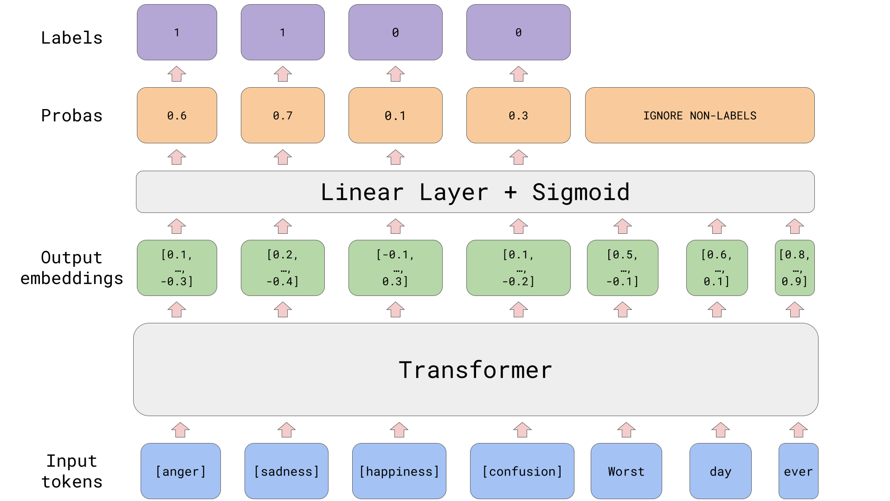

# token-sequence-classification

Use labels as tokens to classify a sequence of text.

For each label, a new token is added to the tokenizer and word embeddings. Each input sequence has each label prepended to the beginning. The output embeddings are put through a linear layer that creates a single logit. All label probas are put through a sigmoid (multi-label) or through softmax (single-label) to determine which label(s) applies(apply) to this example. See the image below for a visualization.



## Pros

- It seems to get better results: [wandb report](https://wandb.ai/nbroad/token-sequence-classification/reports/Token-Sequence-Classification--VmlldzoyNDQ5NDA0?accessToken=ktgqhb909idufl9zmbgie9o0fjjc2uzu3s8eaujo006cyvyert1240pn0ohqicqf).

## Cons

- If there are many labels, the sequence length will get long, slowing the training down.
- If there are more labels than 512, then it won't work at all because the input will only be label tokens and no text.
- It requires custom code.


## Areas to explore

Currently, the label tokens are randomly initialized. It would be interesting to see if it would be beneficial to initially set them as:

- the same as the CLS token embedding
- the average of all token embeddings
- the average of the label's text meaning in token embeddings

To explain the last point, let's use the image above as a reference. For the label `anger`, the text `anger` would be passed to the tokenizer: 

```python
ids = tokenizer("anger", add_special_tokens=False).input_ids
# [4963]
```

 In this case, it results in one token, but it might be multiple depending on the label. The next step is to average the token embeddings. 

 ```python
 avg_value = model.embeddings.word_embeddings.weight.data[torch.tensor(ids)].mean(dim=0)
 ```

This average value now becomes the new embedding value for the label token `[anger]`

 ```python
 label_token_id = tokenizer("[anger]", add_special_tokens=False).input_ids[0]

model.embeddings.word_embeddings.weight.data[label_token_id] = avg_value
```

The thought is that the label's meaning might be a helpful starting place for turning it into a classification token.  